```{r setup, include=FALSE}
options(htmltools.dir.version = FALSE)
```

class: main

# Intro to R:

### Downloading

```{r, echo = FALSE, out.width="80%", fig.align='center'}
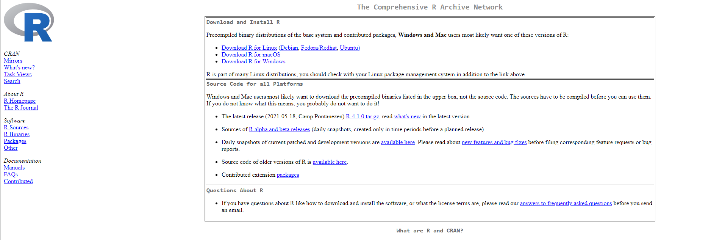
```

---

class: main

# Intro to R: 

### Windows

```{r, echo = FALSE, out.width="80%", fig.align='center'}
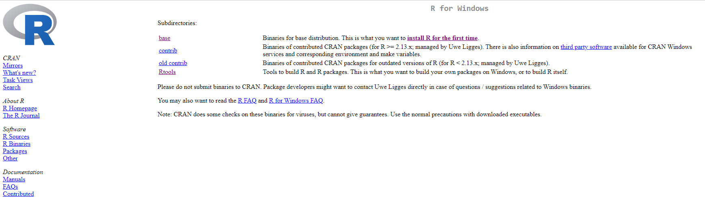
```

---

class: main

# Intro to R: 

### Windows

```{r, echo = FALSE, out.width="80%", fig.align='center'}
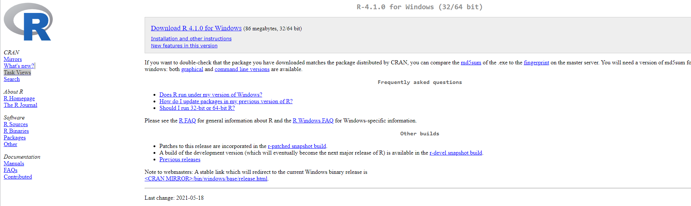
```

---

class: main

# Intro to R: 

### Mac

```{r, echo = FALSE, out.width="80%", fig.align='center'}
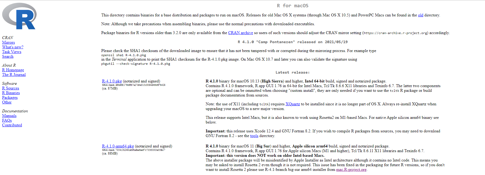
```

---

class: main

# Intro to R: 

### RStudio

```{r, echo = FALSE, out.width="80%", fig.align='center'}
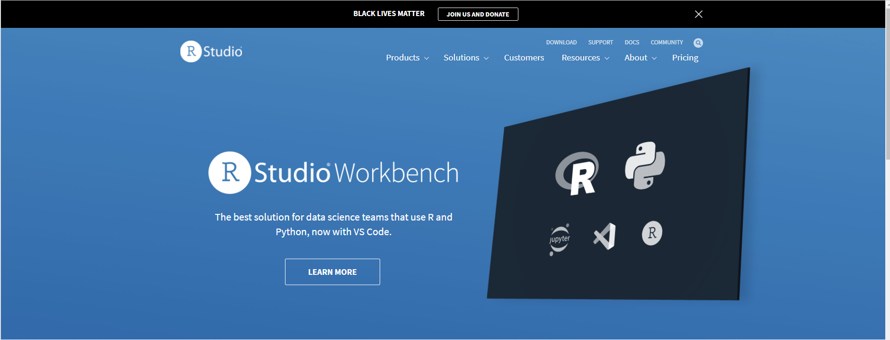
```

---

class: main

# Intro to R: 

### Downloading

```{r, echo = FALSE, out.width="80%", fig.align='center'}
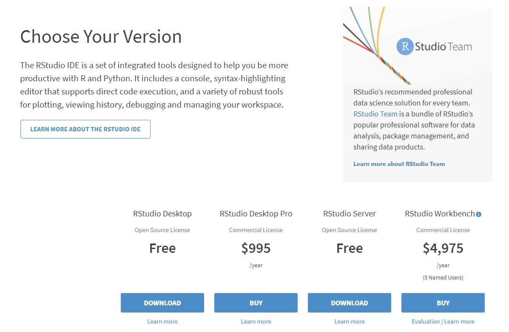
```

---

class: main

# Intro to R:

### Downloading

```{r, echo = FALSE, out.width="80%", fig.align='center'}
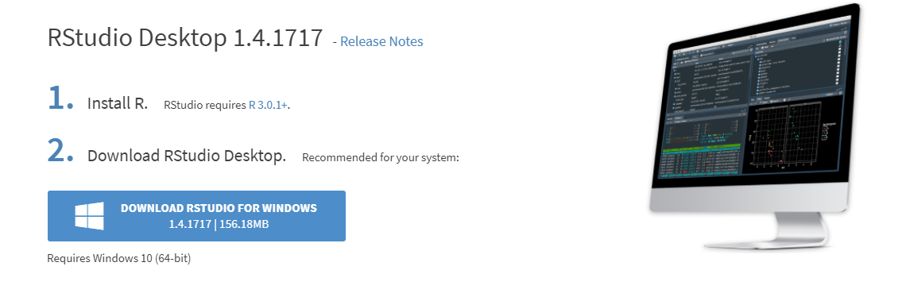
```

---

class: main

# Intro to R: 

### Navigating RStudio

```{r, echo = FALSE, out.width="80%", fig.align='center'}
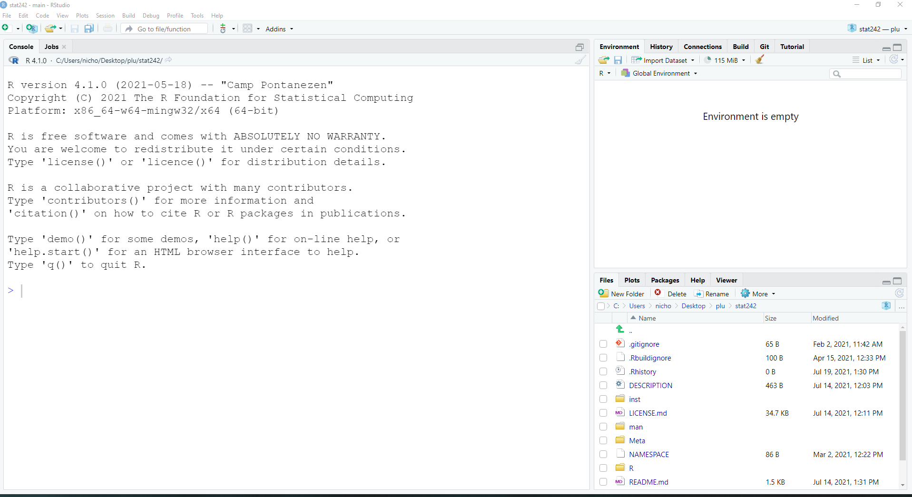
```

---

class: main

# Intro to R:

### Global Options

```{r, echo = FALSE, out.width="50%", fig.align='center'}
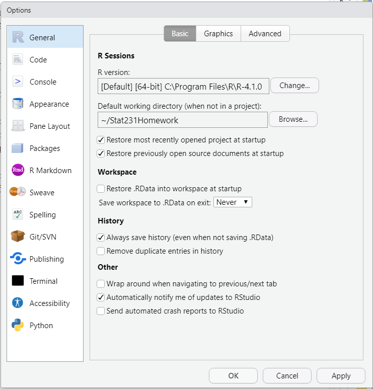
```

---

class: main

# Intro to R:

### Global Options::Code

```{r, echo = FALSE, out.width="50%", fig.align='center'}
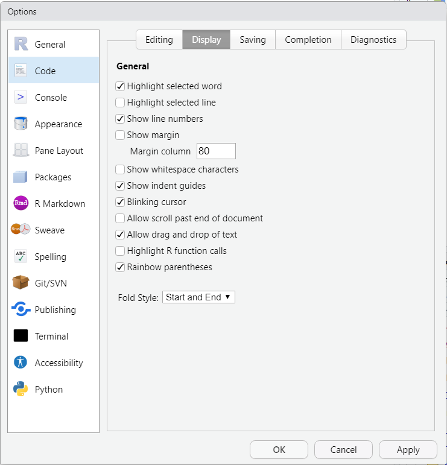
```

---

class: main

# Intro to R:

### Global Options::Appearance 

```{r, echo = FALSE, out.width="50%", fig.align='center'}
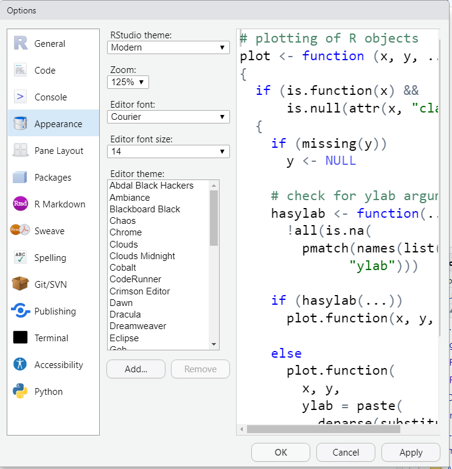
```

---

class: main

# Intro to R:

### Global Options::Pane Layout

```{r, echo = FALSE, out.width="50%", fig.align='center'}
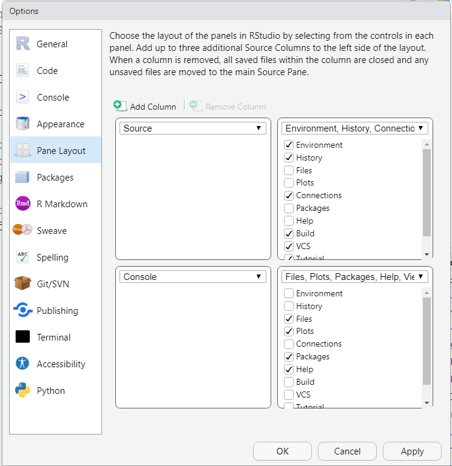
```

---

class: main

# Intro to R:

### Global Options::Pane Layout

```{r, echo = FALSE, out.width="50%", fig.align='center'}
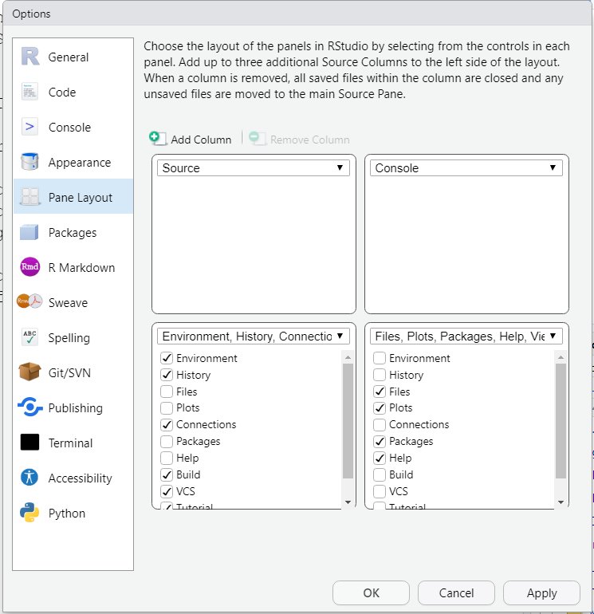
```

---

class: main

# Intro to R:

### RStudio::customized

```{r, echo = FALSE, out.width="80%", fig.align='center'}
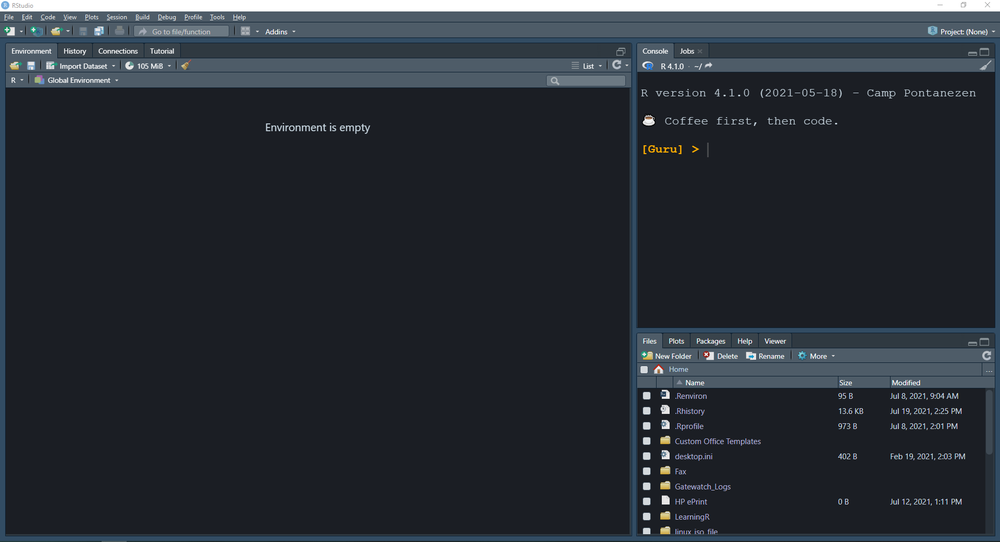
```
